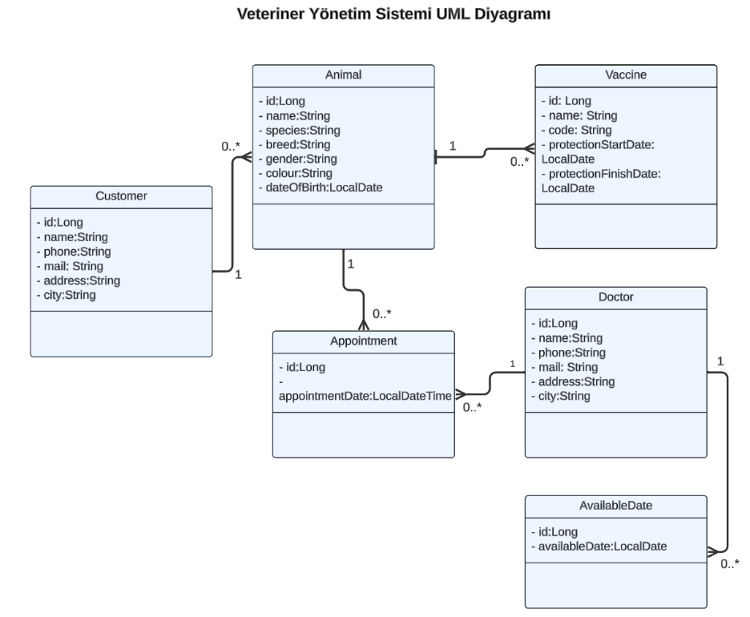
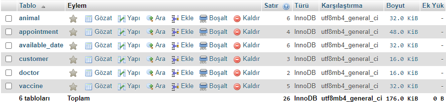

# Veteriner Yönetim Sistemi

Veteriner Yönetim Sistemi, veteriner kliniklerinin günlük işlerini düzenlemek ve yönetmek amacıyla oluşturulmuş bir REST API'dir. Bu API ile veteriner çalışanının veteriner doktorları, müşterileri, hayvanları ve aşılarını, randevuları yönetmesi sağlanır.

## Kullanılan Teknolojiler

<code></code>
<code></code>
<code></code>
<code></code>
<code></code>
<code></code>
<code></code>
<code></code>
<code></code>
<code></code>

## Özellikler

- Veteriner Doktorları Yönetimi: Veteriner doktorları ekleyebilme, güncelleyebilme, görüntüleyebilme ve silebilme yeteneği.
- Müşteri Yönetimi: Müşterileri kaydedebilme, bilgilerini güncelleyebilme, listeleme ve silme yeteneği.
- Hayvan Yönetimi: Hayvanları sisteme kaydedebilme, bilgilerini güncelleyebilme, listeleme ve silme yeteneği.
- Aşı Yönetimi: Hayvanlara uygulanan aşıları kaydedebilme, bilgilerini güncelleyebilme, listeleme ve silme yeteneği.
- Randevu Yönetimi: Veteriner doktorları için randevular oluşturabilme, güncelleyebilme, görüntüleyebilme ve silebilme yeteneği.
- Çeşitli filtreleme yetenekleri

## Ekran Görüntüleri
- UML diyagram

- Veri tabanında yer alan tablolar

## API Kullanımı
Aşağıda, API'nin sunduğu temel endpoint'lerin bir listesi bulunmaktadır:

| Endpoint                                    | HTTP Metodu | Açıklama                                                                           |
|---------------------------------------------|:------------|------------------------------------------------------------------------------------|
| **customers**                               |             |                                                                                    |
| `/api/v1/customers/{id}`                    | GET         | Belirtilen ID'ye sahip hayvan sahibini getirir                                     |
| `/api/v1/customers/{id}`                    | PUT         | Belirtilen ID'ye sahip hayvan sahibini günceller                                   |
| `/api/v1/customers/{id}`                    | DELETE      | Belirtilen ID'ye sahip hayvan sahibini siler                                       |
| `/api/v1/customers`                         | GET         | Tüm hayvan sahiplerini getirir                                                     |
| `/api/v1/customers`                         | POST        | Hayvan sahibi ekler                                                                |
| `/api/v1/customers/searchByName`            | GET         | İsme gore hayvan sahiplerini getirir                                               |
|                                             |             |                                                                                    |
| **animals**                                 |             |                                                                                    |
| `/api/v1/animals/{id}`                      | GET         | Belirtilen ID'ye sahip hayvanı getirir                                             |
| `/api/v1/animals/{id}`                      | PUT         | Belirtilen ID'ye sahip hayvanı günceller                                           |
| `/api/v1/animals/{id}`                      | DELETE      | Belirtilen ID'ye sahip hayvanı siler                                               |
| `/api/v1/animals`                           | GET         | Tüm hayvanları getirir                                                             |
| `/api/v1/animals`                           | POST        | Hayvan ekler                                                                       |
| `/api/v1/animals/searchByName`              | GET         | İsme göre hayvanları filtreler                                                     |
| `/api/v1/animals/searchByCustomer`          | GET         | Hayvan sahiplerine göre hayvanları filtreler                                       |
|                                             |                                    |             |                                                                                    |
| **vaccines**                                |             |                                                                                    |
| `/api/v1/vaccines/{id}`                     | GET         | Belirtilen ID'ye sahip aşıyı getirir                                               |
| `/api/v1/vaccines/{id}`                     | PUT         | Belirtilen ID'ye sahip aşıyı günceller                                             |
| `/api/v1/vaccines/{id}`                     | DELETE      | Belirtilen ID'ye sahip aşıyı siler                                                 |
| `/api/v1/vaccines`                          | GET         | Tum aşıları getirir                                                                |
| `/api/v1/vaccines`                          | POST        | Aşı ekler                                                                          |
| `/api/v1/vaccines/searchByVaccinationRange` | GET         | Girilen tarih araligina gore aşı kayıtlarını getirir                               |
| `/api/v1/vaccines/searchByAnimal`           | GET         | Belirli bir hayvana ait tüm aşı kayıtlarını getirir                                |
|                                             |             |                                                                                    |
| **doctors**                                 |             |                                                                                    |
| `/api/v1/doctors/{id}`                      | GET         | Belirtilen ID'ye sahip doktoru getirir                                             |
| `/api/v1/doctors/{id}`                      | PUT         | Belirtilen ID'ye sahip doktoru günceller                                           |
| `/api/v1/doctors/{id}`                      | DELETE      | Belirtilen ID'ye sahip doktoru siler                                               |
| `/api/v1/doctors`                           | GET         | Tum doktorlari getirir                                                             |
| `/api/v1/doctors`                           | POST        | Doktor ekler                                                                       |
|                                             |             |                                                                                    |
| **available_dates**                         |             |                                                                                    |
| `/api/v1/available_dates/{id}`              | GET         | Belirtilen ID'ye sahip müsait günü getirir                                         |
| `/api/v1/available_dates/{id}`              | PUT         | Belirtilen ID'ye sahip müsait günü günceller                                       |
| `/api/v1/available_dates/{id}`              | DELETE      | Belirtilen ID'ye sahip müsait günü siler                                           |
| `/api/v1/available_dates`                   | GET         | Tüm müsait günü getirir                                                            |
| `/api/v1/available_dates`                   | POST        | Müsait gün ekler                                                                   |
|                                             |             |                                                                                    |
| **appointments**                            |             |                                                                                    |
| `/api/v1/appointments/{id}`                 | GET         | Belirtilen ID'ye sahip randevuyu getirir                                           |
| `/api/v1/appointments/{id}`                 | PUT         | Belirtilen ID'ye sahip randevuyu günceller                                         |
| `/api/v1/appointments/{id}`                 | DELETE      | Belirtilen ID'ye sahip randevuyu siler                                             |
| `/api/v1/appointments`                      | GET         | Tüm randevulari getirir                                                            |
| `/api/v1/appointments`                      | POST        | Randevu ekler                                                                      |
| `/api/v1/appointments/searchByDoctorAndDateRange`             | GET         | Kullanıcı tarafından girilen tarih aralığına ve doktora göre randevuları filtreler |
| `/api/v1/appointments/searchByAnimalAndDateRange`             | GET         | Kullanıcı tarafından girilen tarih aralığına ve hayvana göre randevuları filtreler |

## Kurulum
1. Projeyi klonlayın.
   - git clone https://github.com/alisimsekk/VeterinaryApp.git
2. `src/main/resources/application.properties` dosyasında veri tabanı konfigürasyonunu yapın.
3. Projeyi ayağa kaldırmak için idenizden start edin.
4. Swagger üzerinden api kullanılabilir. Tarayıcınızdan http://localhost:8080/swagger-ui/index.html#/ url'ine gidin.
5. End pointlere istek atabilirsiniz.

## Ortam Değişkenleri

Bu projeyi çalıştırmak için aşağıdaki ortam değişkenlerini application.properties dosyasından değiştirmelisiniz.

spring.datasource.url  
spring.datasource.username  
spring.datasource.password  

## Lisans

[MIT](https://choosealicense.com/licenses/mit/)

